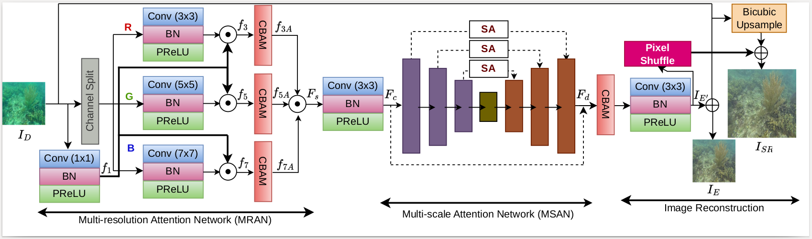

# Lit-Net
Harnessing Multi-resolution and Multi-scale Attention for Underwater Image Restoration.
- Currently, the paper is under review. The code will be uploaded soon.



- This paper deals with the **underwater image restoration**. 
- For this, we have considered two of the main low-level vision tasks, 
  - **image enhancement**, and 
  - **super-resolution**. 
- For underwater image enhancement (uie), we have utilized publicly available datasets 
  - [**EUVP**](http://irvlab.cs.umn.edu/resources/euvp-dataset), and 
  - [**UIEB**](https://li-chongyi.github.io/proj_benchmark.html). 
- For super-resolution, we have used [**UFO-120**](http://irvlab.cs.umn.edu/resources/ufo-120-dataset) dataset. 

Also, the codes work with *minimum* requirements as given below.
```bash
# tested with the following dependencies on Ubuntu 16.04 LTS system:
Python 3.5.2
Pytorch '1.0.1.post2'
torchvision 0.2.2
opencv 4.0.0
scipy 1.2.1
numpy 1.16.2
tqdm
```

### Datasets Preparation


### Usage
##### For testing
- Once the test-sets as described [**above**](#datasets-preparation) are set.
- You can test a model for a given task using the following command:
```bash
export CUDA_VISIBLE_DEVICES=0 #[optional]
python test.py  
```
- Results will be saved in `facades` folder of the `pwd`.

##### For training
- Once the training-sets as described [**above**](#datasets-preparation) are set.
- You can train a model for a given task using the following command:
```bash
export CUDA_VISIBLE_DEVICES=0 #[optional]
python train.py --checkpoints_dir --batch_size --learning_rate             
```
- `Models` will be saved in `--checkpoints_dir` with naming convention `netG_[epoch].pt`.
- Demo codes for plotting loss curve during training are provided in [**utils/loss**]() folder.


### For Underwater Semantic Segmentation
- To generate segmentation maps on enhanced images, follow [**SUIM**](https://github.com/xahidbuffon/SUIM). 

### Send us feedback
- If you have any queries or feedback, please contact us @(**p.alik@iitg.ac.in**).

### Acknowledgements
- Some portion of the code are adapted from [**DeepWaveNet**]([https://github.com/xahidbuffon/FUnIE-GAN](https://github.com/pksvision/Deep-WaveNet-Underwater-Image-Restoration)). The authors greatfully acknowledge it!
